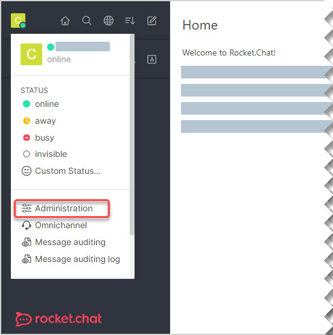

[TOC]

# FILE UPLOAD

To access this menu click the user icon on the top left and navigate to **Administration > File Upload**.

Use the **File Upload** menu to set the configurations for the upload of files on **Rocket.Chat**.

Notice that:

- The page does not save changes automatically. Make sure to click **Save changes** before leaving this menu

- Click **Reset Section to Default** to reset all the configurations on a section at once, or

- Click the **Reset** icon to reset a specific field or parameter
  

## General Settings

The following settings apply to any files uploaded on your server, independently of the storage type.

- | Configuration                                         | Description                                                  |
  | ----------------------------------------------------- | ------------------------------------------------------------ |
  | **File Uploads Enabled**                              | Enable this parameter to allow users to upload files on your server. |
  | **Maximum File Upload Size (in bytes)**               | Type in the maximum allowed file size for upload (in bytes). |
  | **Accepted Media Types**                              | Enter the media types accepted for upload separated by commas. |
  | **Blocked Media Types**                               | Enter the media types block from upload separated by commas.  _**NOTE: **This setting overrides the Accepted Media Types._ |
  | **Protect Uploaded Files**                            | Enable this parameter so that only authenticated users can have access to uploaded files.  **NOTE:* **_Unauthenticated users are still able to access and download uploaded files by using the file’s URL._ |
  | **Rotate images on upload**                           | Enable this parameter to allow the rotation of images on upload.  **NOTE:** _This may cause image quality loss._ |
  | **Enable JSON Web Tokens protection to file uploads** | Enable this parameter to append a JSON Web Token (JWT) to the uploaded files. You can use a JWT for allowing access to uploaded files for users without authentication. |
  | **File Upload Json Web Token Secret**                 | Enter the JWT Secret to enable access to uploaded files without authentication. |
  | **Storage Type**                                      | Select the appropriate option for storing the uploaded files:<ul><li>AmazonS3</li><li>File System</li><li>Google Cloud Storage</li><li>Google Vision</li><li>WebDAV<li></ul> |
  | **File Uploads Enabled in Direct Messages**           | Enable this parameter to allow users to upload files in your server via direct messages. |

## Storage Specific Settings

Use the following settings when configuring your preferred storage server.  

#### Amazon S3

For more details on how to set up the Amazon S3 server see the dedicated article [here](https://docs.rocket.chat/guides/administration/settings/file-upload/amazon-s3).

|Configuration|Description|
| ------------------------------------- | ------------------------------------------------------------ |
|**Acl** |Optional field. Enter a *Canned ACL* configuration option. *Canned ACLs* are sets of predefined grantees and permissions. See a full list of *canned ACLs* and their characteristics [here](http://docs.aws.amazon.com/AmazonS3/latest/dev/acl-overview.html#canned-acl).|
| **CDN Domain for  Downloads** | Optional field. Enter the CDN domain for your bucket if you have one created. |
| **Region**                | Optional field. Enter the code of the region code set for your bucket, if other than the US Standard. You can access a list of region codes [here](http://docs.aws.amazon.com/AWSEC2/latest/UserGuide/using-regions-availability-zones.html#concepts-available-regions). |
| **Bucket URL**            | Optional field. Enter the bucket URL to where the files are uploaded. The system will also use this URL for downloads unless you provide a CDN. |
| **Signature Version**                 | Define the AWS Signature version to support for authenticated requests. |
| **Force Path Style**                  | Enable this parameter to force the style used on the files paths. |
| **URLs Expiration Timespan**        | Set the maximum time (in seconds) the URLs generated by Amazon S3 will be valid. Values under 5 seconds are ignored. ***NOTE:** Some users located further from the server location may notice files not loading consistently. If you run into this issue, try increasing the expiration timespan.* |
| **Proxy Avatars**                     | Enable this parameter to use proxy avatar file transmissions through your server instead of direct access to the asset's URL. |
| **Proxy Uploads**                     | Enable this parameter to use proxy upload file transmissions through your server instead of direct access to the asset's URL |

#### File System

Populate the field **System Path** with the local path the uploaded files store location.

#### Google Cloud Storage

For more details on how to set up the Google Cloud Storage server see the dedicated article [here](https://docs.rocket.chat/guides/administration/settings/file-upload/google-cloud-storage).

|Configuration|Description|
| ------------- | ------------------------------------------------------------ |
| **Proxy Avatars** | Enable this parameter to use proxy avatar file transmissions through your server instead of direct access to the asset's URL. |
| **Proxy Uploads** | Enable this parameter to use proxy upload file transmissions through your server instead of direct access to the asset's URL |

#### Google Vision

>  Please notice Google Vision is a Paid API from Google. The use of this API it on Rocket.Chat may generate fees, as described on [Google Vision](https://cloud.google.com/vision/) page.

|Configuration|Description|
| ------------------------------ | ------------------------------------------------------------ |
| **Enable Google Vision**       | This enables the  Google vision feature on your server.      |
| **Google Vision  Service Account** | Create a server key  (JSON format) and paste the JSON content in the field. |
| **Max Monthly Calls**          | Here, you can define  the maximum number of calls made in a month.  Use 0 for unlimited |
| **Current Month Calls**        | Here it will be  displayed how many calls were made this month |
| **Document Text  Detection**   | This will enable  text detection on images, when text is detected on an image, a property with  the text will be added on the file entry in the database. |
| **Face Detection**             | This will enable  face detection on images, when a face is detected on an image, a property  with the face information will be added on the file entry in the database. |
| **Landmarks Detection**        | This will enable  landmarks detection on images, when a landmark is detected on an image, a  property with the landmark information will be added on the file entry in the  database. |
| **Labels Detection**           | This will enable  labeling on uploaded images, then a property with the image labels will be  added to the file entry in the database.  E.g If you post an  image of a cat with glasses, the categories CAT and GLASSES will be added to  the file. |
| **Logos Detection**            | This will enable  logos detection on images, when a logo is detected on an image, a property  with the logo information will be added on the file entry in the database. |
| **Properties (Color)  Detection** | This will enable  color detection on images, this will create a property with the colors used  on the image on the file entry in the database. |
| **SafeSearch Detection**       | Safe Search  Detection detects explicit content such as adult content or violent content  within an image. This feature uses five categories ("adult",  "spoof", "medical", "violence", and  "racy") and returns the likelihood that each is present in a given  image  Categories will be  added as a property on the file entry on the database. |
| **Block Adult Images**         | This setting enables  the blocking of adult images  Blocking adult  images will not work once the monthly limit has been reached |
| **Search Similar  Images**     | This will enable  users to search for similar images directly from Rocket. Chat. |

#### WebDAV

|Configuration|Description|
| ------------------------- | ------------------------------------------------------------ |
| **Upload Folder Path**    | WebDAV folder path to  which the files should be uploaded.   |
| **WebDAV Server Access  URL** | The URL of the  WebDAV server (WebDAV URLs of Common Cloud Storage Services). |
| **WebDAV Username**       | Username for the  remote WebDav server.                      |
| **WebDAV Password**       | Password for the  remote WebDAV server.                      |
| **Proxy Avatars**         | Enable this parameter to use proxy avatar file transmissions through your server instead of direct access to the asset's URL. |
| **Proxy Uploads**         | Enable this parameter to use proxy upload file transmissions through your server instead of direct access to the asset's URL |

 
